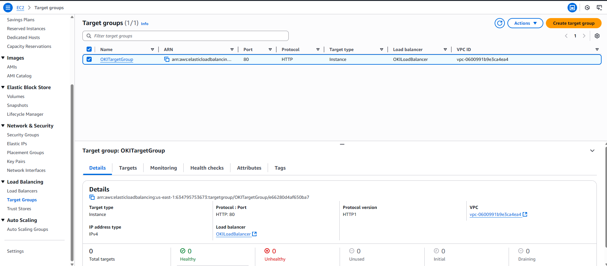
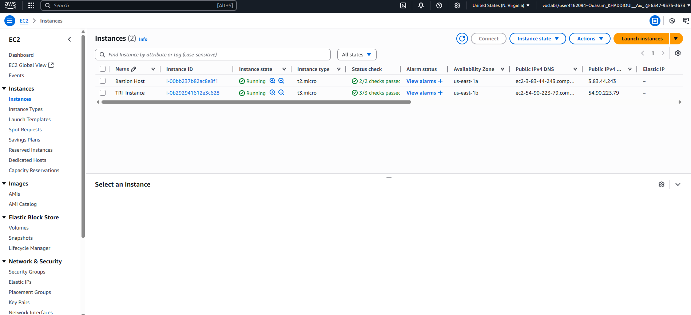
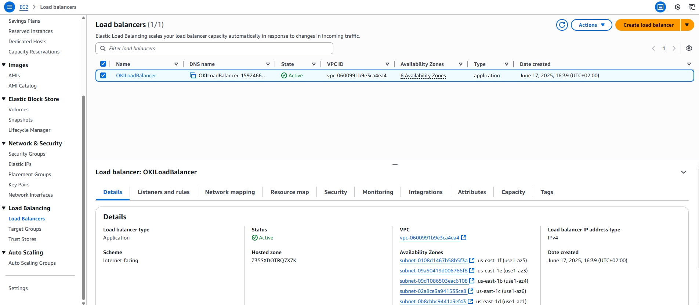
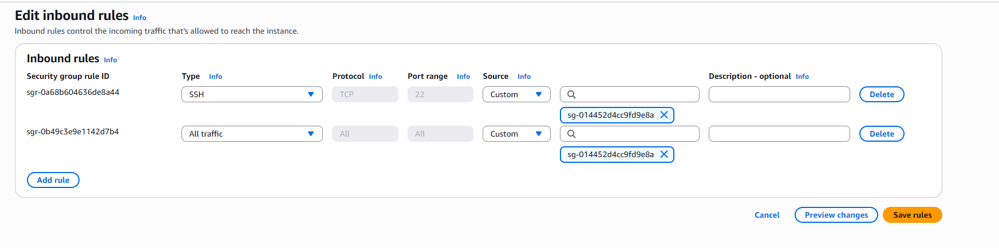
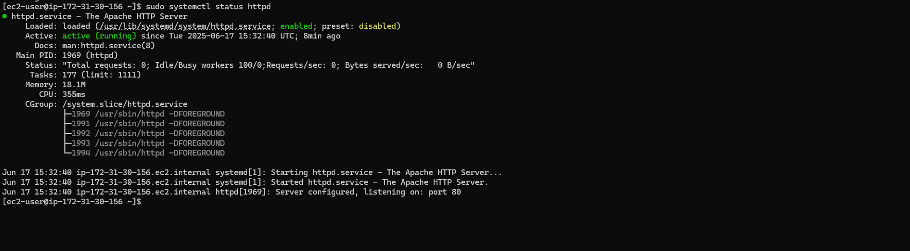
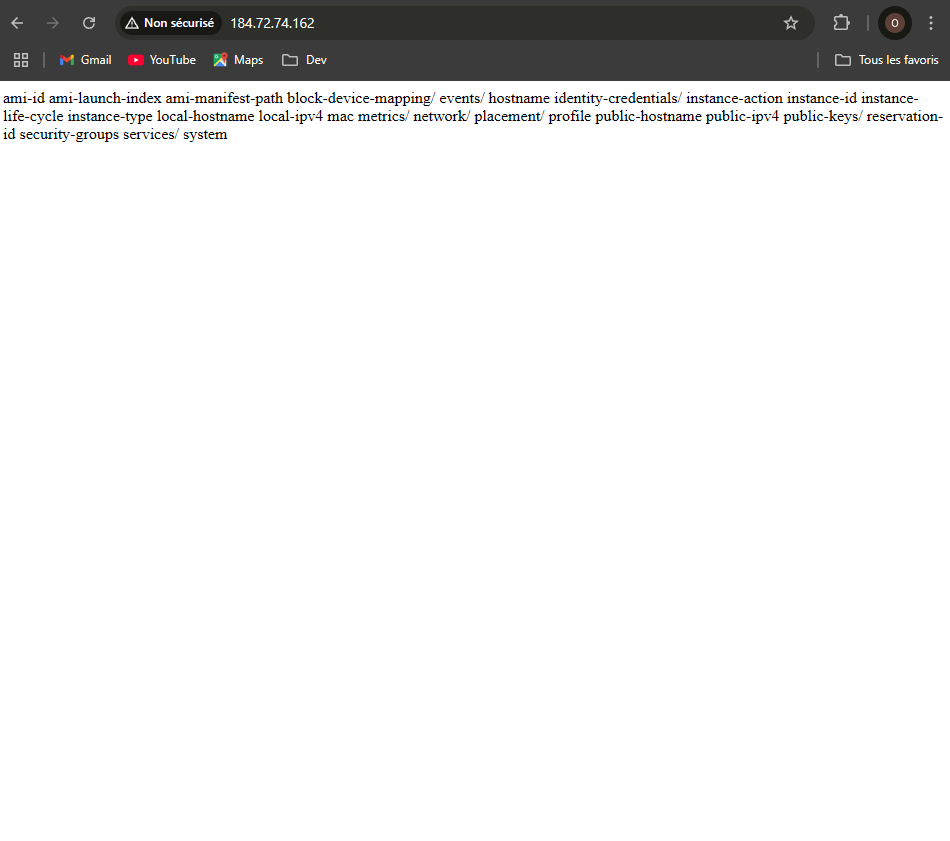
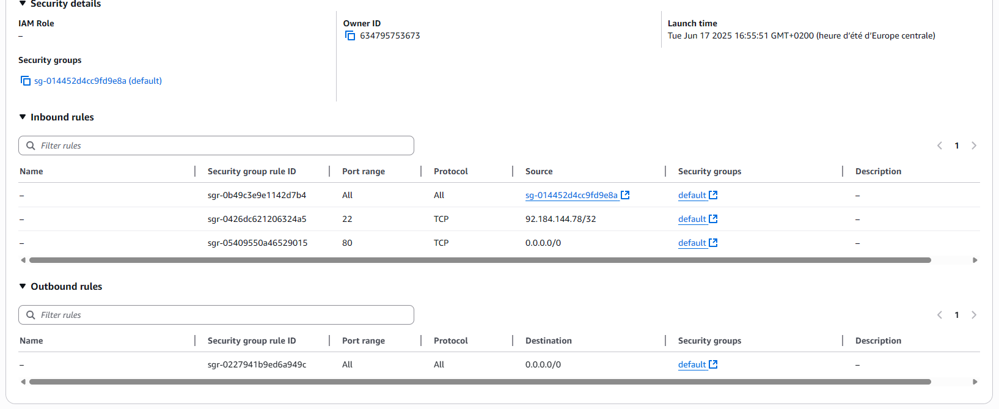
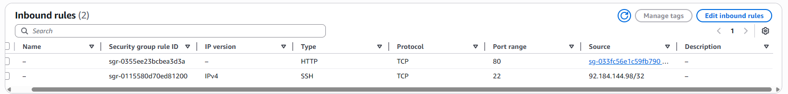
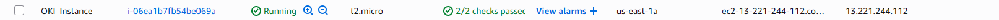
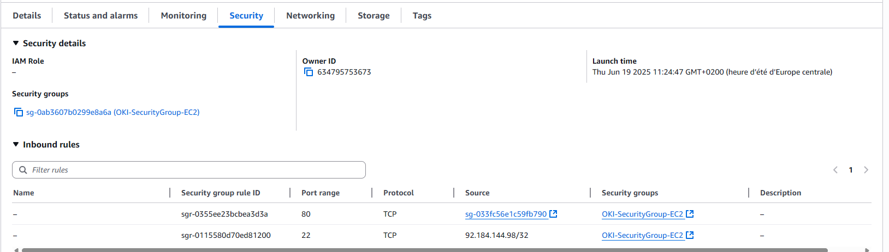

# 🧪 TP AWS – Infrastructure Cloud – TRI

## Partie 1 : Création d'un Load Balancer (LB)

### 1. Création du Target Group `TRI_TargetGroup`

### 2. Création du Load Balancer `TRI_LoadBalancer`

### 3. Création du Security Group `TRI_SecurityGroup_LB`

## Partie 2 : Création d’une Amazon Machine Image (AMI)

## Partie 3 : Création de la première instance EC2 et configuration des security groups

## Partie 4 : Installation de l'AWS CLI et ajout d’une seconde instance

Impossible